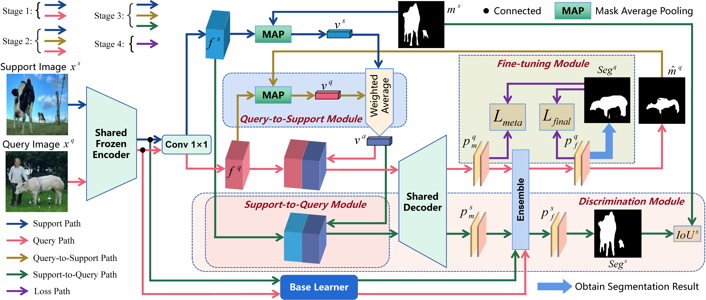

# EFTNet: An Efficient Fine-tuning Method for Few-Shot Segmentation

> **Abstract:** *Few-shot segmentation (FSS) aims to segment novel classes given a small number of labeled samples. Most of the existing studies do not fine-tune the model during meta-testing, thus biasing the model towards the base classes and difficult to predict the novel classes. Other studies only use the support images for fine-tuning, which biases the model towards the support images rather than the target query images, especially when there is a large difference between the support and the query images. To alleviate these issues, we propose an **e**fficient **f**ine-**t**uning network (EFTNet) that uses the unlabeled query images and the predicted pseudo labels to fine-tune the trained model parameters during meta-testing, which can bias the model towards the target query images. In addition, we design a query-to-support module, a support-to-query module, and a discrimination module to evaluate which fine-tuning round the model achieves optimal. Moreover, the query-to-support module also takes the query images and their pseudo masks as part of the support images and support masks, which makes the prototypes contain query information and tends to get better predictions. As a new meta-testing scheme, our EFTNet can be easily combined with existing studies and greatly improve their model performance without redoing the meta-training phase. Plenty of experiments on PASCAL-5<sup>i</sup> and COCO-20<sup>i</sup> prove the effectiveness of our EFTNet. The EFTNet also achieves new state-of-the-art.*

<p align="middle">
  
</p>

### Dependencies

- RTX 3090
- Python 3.8
- PyTorch 1.12.0
- cuda 11.6
- torchvision 0.13.0
- tensorboardX 2.2


### Datasets

- PASCAL-5<sup>i</sup>:  [VOC2012](http://host.robots.ox.ac.uk/pascal/VOC/voc2012/) + [SBD](http://home.bharathh.info/pubs/codes/SBD/download.html)

- COCO-20<sup>i</sup>:  [COCO2014](https://cocodataset.org/#download)
- Put the datasets into the `EFTNet/data/` directory.
- Download the data lists from [BAM](https://github.com/chunbolang/BAM) and put them into the `EFTNet/lists` directory.
- Run `util/get_mulway_base_data.py` to generate base annotations and put them into the `EFTNet/data/base_annotation/` directory.

### Models

- Download the pre-trained backbones from [MSANet](https://github.com/AIVResearch/MSANet) and put them into the `EFTNet/initmodel` directory. 
- Download the trained base learners from [MSANet](https://github.com/AIVResearch/MSANet) and put them under `initmodel/PSPNet`. 
- Download the trained [MSANet](https://github.com/AIVResearch/MSANet) and put them into the `EFTNet/weights` directory.

### Scripts

- Change configuration and add weight path to `.yaml` files in `EFTNet/config` , then run the `meta_test.sh` file for testing.


## References

This repo is mainly built based on [MSANet](https://github.com/AIVResearch/MSANet), [PFENet](https://github.com/dvlab-research/PFENet), and [BAM](https://github.com/chunbolang/BAM). Thanks for their great work!

````
This paper has been accepted for publication in Applied Intelligence.
